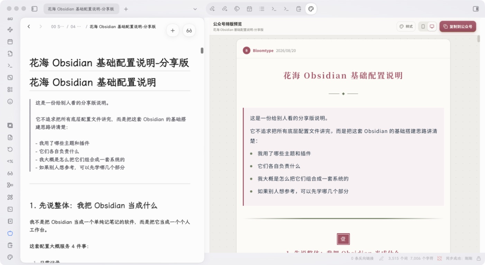
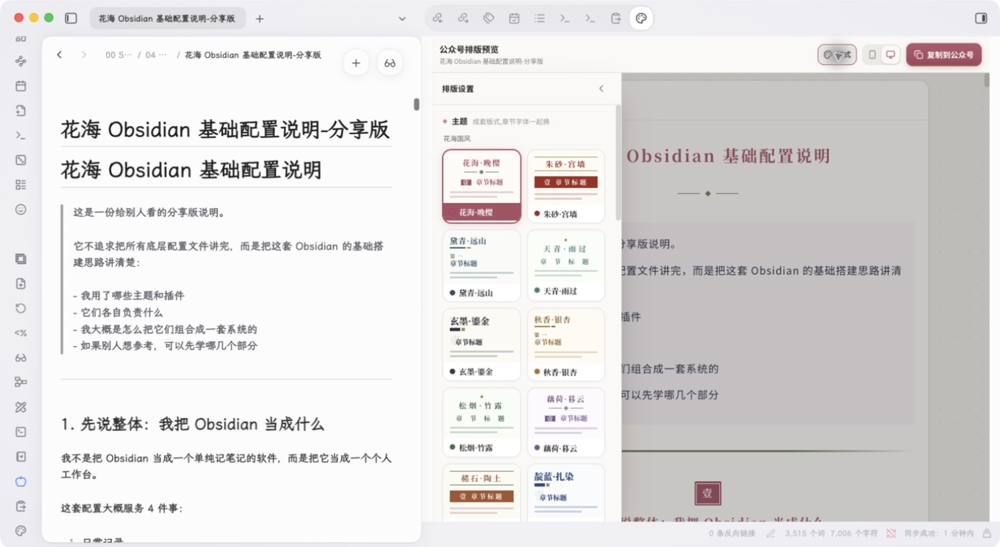

# Bloomtype Obsidian 插件

在 Obsidian 中写 Markdown，在右侧直接查看公众号排版，并复制富文本到微信公众号编辑器。Obsidian 笔记是唯一文稿源，插件不会再提供一套重复的 Markdown 编辑器。

> 当前为公开测试版，正在申请加入 Obsidian 官方社区插件市场。

## 界面预览



在 Obsidian 原笔记中写作，右侧同步显示公众号排版；默认使用电脑预览，也可以切换手机宽度后检查阅读效果。



样式面板针对窄侧栏重新排布，可直接选择主题、配色和章节样式，不需要离开 Obsidian。

## 功能

- 从左侧功能区一键打开 Bloomtype 侧栏。
- 自动载入当前 Markdown 笔记并实时同步修改。
- 提供专为 Obsidian 窄侧栏设计的紧凑工具栏。
- 在侧栏内切换排版主题、配色和手机/电脑预览。
- 一键复制公众号兼容的富文本。
- 切换笔记或修改原文后自动同步，带 450 ms 防抖。
- 命令面板支持打开、同步、重载预览和浏览器打开。
- 服务地址可配置，默认使用 [Bloomtype](https://mp.autoaihub.cn)。

## 安装

### 从 GitHub Release 手动安装

1. 从最新 Release 下载 `main.js`、`manifest.json` 和 `styles.css`。
2. 在 Vault 中创建 `.obsidian/plugins/bloomtype-publisher/`。
3. 把三个文件放入该目录。
4. 打开“设置 → 第三方插件”，启用“Bloomtype 排版”。

### 使用 BRAT

将本仓库地址添加到 BRAT，即可作为公开测试版安装和更新。

### 从源码安装

```bash
npm install
npm run build
npm run install:vault -- /path/to/your/vault
```

安装脚本会复制构建文件并启用插件；若 Vault 已有第三方插件列表，会先创建备份。

## 使用

1. 在 Obsidian 中打开一篇 Markdown 笔记。
2. 点击左侧功能区的调色盘图标。
3. 在右侧预览中选择模板、配色和预览宽度。
4. 点击“复制到公众号”，粘贴到微信公众号编辑器。

## 数据与隐私

为了生成预览，插件会把当前 Markdown 笔记内容通过受来源限制的 `postMessage` 发送给设置中配置的 Bloomtype 页面。默认页面为 `https://mp.autoaihub.cn`。

- 插件不会读取当前 Markdown 笔记之外的文件。
- Obsidian 嵌入模式不会加载网站统计或客户端遥测脚本。
- 远程服务地址必须使用 HTTPS；本机调试允许 localhost HTTP。
- 超过 5 MB 的笔记不会自动同步。
- 请只配置你信任的服务地址；敏感内容建议使用可信的本地服务。

更多信息见 [PRIVACY.md](PRIVACY.md) 和 [SECURITY.md](SECURITY.md)。

## 本地开发

```bash
npm install
npm run dev
```

本地联调：

1. 启动兼容 Bloomtype 消息桥接协议的页面。
2. 在插件设置中把服务地址改为 `http://localhost:3000`。
3. 在 Obsidian 中重新加载插件并打开任意 Markdown 笔记。

生产构建：

```bash
npm run build
```

构建产物为 `main.js`，发布时需与 `manifest.json`、`styles.css` 一起作为 GitHub Release 附件。

## 参与贡献

欢迎提交 Issue 和 Pull Request。开发规范见 [CONTRIBUTING.md](CONTRIBUTING.md)。

## 许可证

[MIT](LICENSE) © 2026 花海
